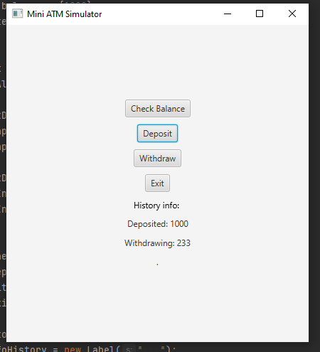
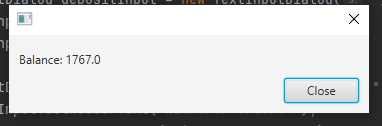
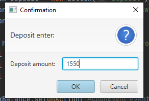
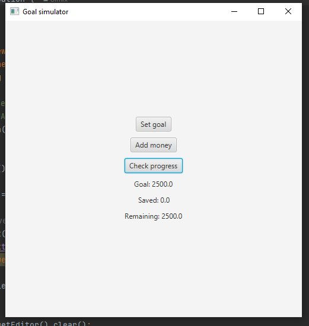
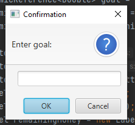
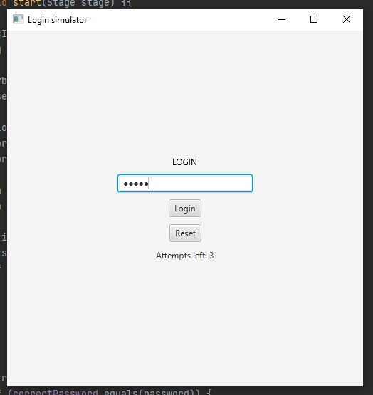
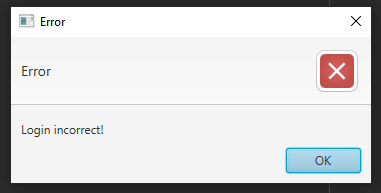

# JavaFX Learning – 3 Mini Projects

Small projects created for learning GUI development with JavaFX and adding basic functionality.  
These applications perform simple tasks such as checking balance, depositing money, setting goals, and validating login credentials with login attempt limits.

---

# 1. Mini ATM Simulator

## Features
- Check balance
- Deposit money
- Withdraw money
- Transaction history
- Exit system

## Screenshot

  
  
  

  Main | Balance | Deposit

# 2. Goal Simulator

## Features
- Set a financial goal
- Add money
- Check progress

## Screenshot

  
  

  Main | Enter goal

# 3. Login Simulator

## Features
- Login system
- Password validation
- Login attempts limit
- Reset attempts

## Screenshot

  
  

  Main | Message

# Technologies Used
- Java
- JavaFX

---

# Purpose

These projects were created for practice and learning:
- JavaFX GUI development
- Event handling
- Working with buttons, labels, text fields, and layouts
- Basic application logic and user interaction